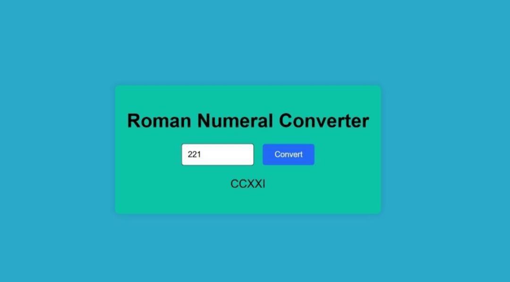

# Personal Portfolio 🚀

## Project Description 📝
### Project Description for Latifa Wakili's Portfolio

This portfolio website, created using HTML, CSS, and JavaScript, showcases the work and skills of Latifa Wakili, a web developer specializing in product development and responsive web design. The site is designed to provide a visually engaging and comprehensive platform to highlight Latifa's expertise, achievements, and aspirations. Key features of the portfolio include:
- **Interactive Navigation**: A hamburger menu for mobile and a traditional menu for desktop provide easy navigation throughout the site.
- **Professional Profile**: Sections like "About Me," "Skills," and "Certifications" detail Latifa's background, technical skills, and professional accomplishments.
- **Project Showcase**: A dedicated "My Work" section highlights various projects Latifa has worked on, complete with screenshots and detailed descriptions.
- **Contact Form**: Visitors can easily get in touch with Latifa through a straightforward contact form, making it simple to reach out for potential collaborations or inquiries.

```html
  <div class="project-screenshot">
              
            </div>
            <button class="see-project" id="see-project1">See project</button>
          </div>
```

```css
#contact-form input
#contact-form textarea {
  width: 100%;
  padding: 15px;
  margin-bottom: 20px;
  border: 1px solid #ccc;
  border-radius: 5px;
  font-size: 16px;
}

#contact-form button {
  padding: 8px 30px;
  background-color: #f2d4d}
```

```javascript
const projectsContainer = document.getElementById('projects-container');
const popup = document.getElementById('popup');
const popupImg = document.getElementById('popup-img');
```
## Demo 📸
![Demo]

## Technologies Used 🛠️

- HTML
- CSS
- JavaScript

## Usage 🎯
To use this website, you only should have a browser.

## Author 👩‍💻
- Twitter: [@Latifa_Wakili](https://x.com/WakiliLatifa?t=wlHTh8JuyFprQsN_hZQGWQ&s=08)
- LinkedIn: [Latifa Wakili](https://www.linkedin.com/in/latifa-wakili-68423b277?utm_source=share&utm_campaign=share_via&utm_content=profile&utm_medium=android_app)
- Email: [Latifa Wakili](saavenwakili@gmail.com)

## Contributing 🤝
It was a great team work with designers (Hadia Rauf, Froozan Azimi, Fatana Yaqubi, and Marzia Arman), who designed this special Portfolio page for me, thanks dears.

